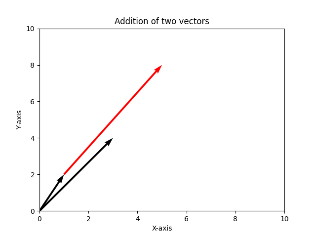
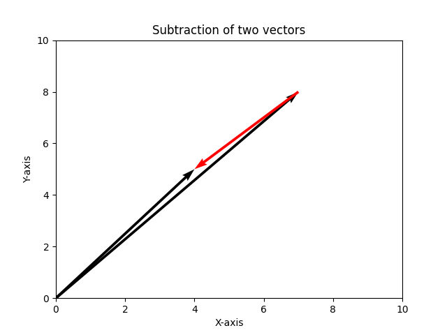

# Plot-Vector-Graphs-With-Python
A program that will flot vector graph using python

At first you need to run the command in your terminal to download the library of numpy and matplotlib.

Please run this command on your terminal : pip install -r requirements.txt

Once you did it you are ready to run the program.

You will be asked to enter the value of two vectors, enter the value and chooce to either add the vector or subtract the vector. Once you run the program you will see this output : 

